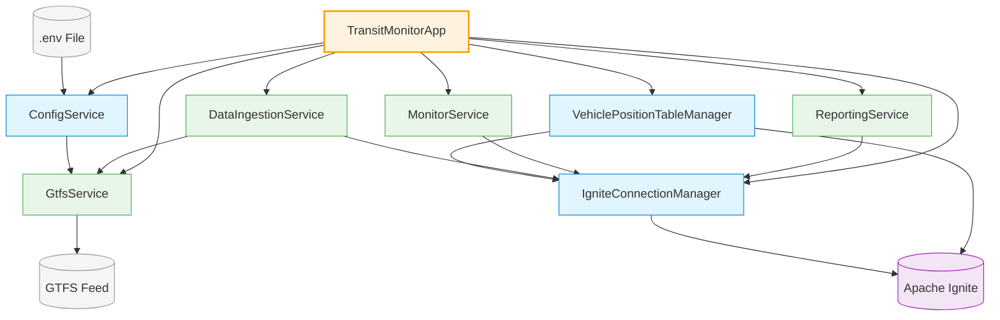
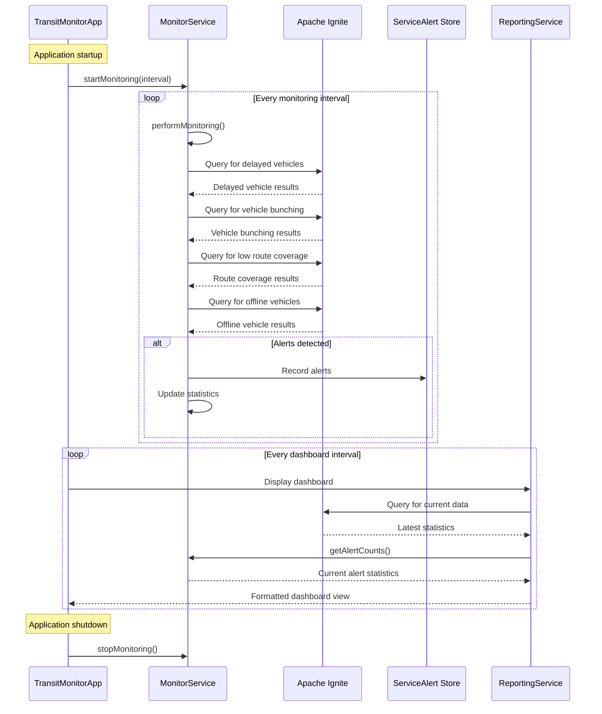

# Putting It All Together

In this final module, we'll orchestrate all the components we've built into a cohesive application and explore how your transit monitoring system operates. By the end, you'll have a complete, running application.

## The Application Architecture

Before diving into the code, let's review the complete architecture of our transit monitoring system:



This architecture demonstrates several important design principles:

1. **Component Separation**: Each class has a clear, focused responsibility
2. **Clean Integration**: Components interact through well-defined interfaces
3. **Central Coordination**: The main application orchestrates all components
4. **Configuration Management**: External configuration keeps credentials secure
5. **Resource Lifecycle**: Components are properly started and stopped

## The Monitoring Process Workflow

The monitoring system follows a specific workflow to detect potential service disruptions:



This workflow shows how:

1. The monitoring service runs queries at specified intervals
2. Each query type targets a specific service disruption condition
3. Detected issues generate alerts that are stored and tracked
4. The dashboard regularly updates with the latest statistics

## Exploring the Main Application

Let's examine the `TransitMonitorApp` class that ties everything together. Open the file:

```shell
open src/main/java/com/example/transit/app/TransitMonitorApp.java
```

The class starts by defining key components and configuration values:

```java
// Configuration constants
private static final int INGESTION_INTERVAL = 30;  // seconds
private static final int MONITORING_INTERVAL = 60; // seconds
private static final int DASHBOARD_REFRESH = 10;   // seconds

// Dashboard view types
private static final int VIEW_SUMMARY = 0;
private static final int VIEW_ALERTS = 1;
private static final int VIEW_DETAILS = 2;
private static final int TOTAL_VIEWS = 3;

// Core services
private final ConnectService connectionService;
private final IngestService ingestionService;
private final MonitorService monitoringService;
private final ReportService reportingService;
private final ScheduledExecutorService dashboardScheduler;
private final IgniteClient client;

// Dashboard state
private final AtomicInteger currentView = new AtomicInteger(0);
private boolean isRunning = false;
```

These fields define:

1. **Configuration constants** for service intervals
2. **Dashboard view types** for different display modes
3. **Core services** that handle different aspects of the application
4. **State variables** to track the application's status

The constructor initializes all services:

```java
public TransitMonitorApp() {
    // Get configuration
    ConfigService config = ConfigService.getInstance();
    if (!config.validateConfiguration()) {
        throw new IllegalStateException("Invalid configuration");
    }

    // Initialize core services
    this.connectionService = new ConnectService();
    this.client = connectionService.getClient();
    this.ingestionService = new IngestService(
            new GtfsService(config.getFeedUrl()),
            connectionService)
            .withBatchSize(100);
    this.monitoringService = new MonitorService(connectionService);
    this.reportingService = new ReportService(client);
    this.dashboardScheduler = Executors.newSingleThreadScheduledExecutor(r -> {
        Thread t = new Thread(r, "dashboard-thread");
        t.setDaemon(true);
        return t;
    });

    // Set quiet mode to true to suppress individual alert output
    this.monitoringService.setQuietMode(true);
}
```

This constructor:

1. Loads and validates the configuration
2. Creates the core service instances
3. Sets up a scheduler for the dashboard updates
4. Configures the monitoring service to suppress individual alert messages

## Starting and Stopping the Application

The `start()` method starts all services:

```java
public boolean start() {
    if (isRunning) {
        TerminalUtil.logInfo("System already running");
        return true;
    }

    try {
        // Setup UI
        TerminalUtil.clearScreen();
        TerminalUtil.printWelcomeBanner();
        TerminalUtil.showStartupAnimation();

        // Setup database
        TerminalUtil.logInfo("Setting up database schema...");
        boolean schemaCreated = new SchemaService(connectionService).createSchema();
        if (!schemaCreated) {
            TerminalUtil.logError("Schema creation failed. Aborting.");
            return false;
        }

        // Start services
        TerminalUtil.logInfo("Starting data ingestion (interval: " + INGESTION_INTERVAL + "s)");
        ingestionService.start(INGESTION_INTERVAL);

        TerminalUtil.logInfo("Starting monitoring (interval: " + MONITORING_INTERVAL + "s)");
        monitoringService.startMonitoring(MONITORING_INTERVAL);

        // Start dashboard
        startDashboard();

        isRunning = true;
        TerminalUtil.logInfo(TerminalUtil.ANSI_GREEN + "Transit monitoring system started" + TerminalUtil.ANSI_RESET);
        return true;
    } catch (Exception e) {
        TerminalUtil.logError("Startup error: " + e.getMessage());
        stop();
        return false;
    }
}
```

This method:

1. Performs UI setup with welcome messages and animations
2. Creates the database schema if it doesn't exist
3. Starts the data ingestion service
4. Starts the monitoring service
5. Starts the dashboard display
6. Updates the application state

The `stop()` method shuts down all services:

```java
public void stop() {
    TerminalUtil.logInfo("Stopping Transit Monitoring System");
    TerminalUtil.showShutdownAnimation();

    // Stop all services
    shutdownScheduler(dashboardScheduler);
    monitoringService.stopMonitoring();
    ingestionService.stop();

    try {
        connectionService.close();
    } catch (Exception e) {
        TerminalUtil.logError("Error closing connection: " + e.getMessage());
    }

    isRunning = false;
    TerminalUtil.logInfo(TerminalUtil.ANSI_GREEN + "System stopped" + TerminalUtil.ANSI_RESET);
}
```

This method performs an orderly shutdown:

1. Stops the dashboard updates
2. Stops the monitoring service
3. Stops the data ingestion service
4. Closes the database connection
5. Updates the application state

## The Dashboard System

The `startDashboard()` method sets up periodic updates of the console display:

```java
private void startDashboard() {
    TerminalUtil.logInfo("Starting dashboard (refresh: " + DASHBOARD_REFRESH + "s)");
    dashboardScheduler.scheduleAtFixedRate(() -> {
        try {
            // Rotate through views
            displayDashboard(currentView.get());
            currentView.set((currentView.get() + 1) % TOTAL_VIEWS);
        } catch (Exception e) {
            TerminalUtil.logError("Dashboard error: " + e.getMessage());
        }
    }, DASHBOARD_REFRESH, DASHBOARD_REFRESH, TimeUnit.SECONDS);
}
```

This method:

1. Creates a scheduled task that runs at the specified interval
2. Displays the current dashboard view
3. Rotates to the next view for the next update
4. Handles errors to prevent the dashboard from crashing

The dashboard has three different views that are displayed in rotation:

```java
private void displayDashboard(int viewType) {
    int terminalWidth = TerminalUtil.getTerminalWidth();
    TerminalUtil.clearScreen();

    // Display header
    reportingService.printDashboardHeader(terminalWidth);

    // Display view title
    String viewTitle = reportingService.getViewTitle(viewType);
    System.out.println(TerminalUtil.ANSI_BOLD + TerminalUtil.ANSI_YELLOW + viewTitle + TerminalUtil.ANSI_RESET);
    System.out.println(TerminalUtil.ANSI_CYAN + "─".repeat(Math.min(terminalWidth, 80)) + TerminalUtil.ANSI_RESET);

    // Display view content
    switch (viewType) {
        case VIEW_SUMMARY:  displaySummaryView(); break;
        case VIEW_ALERTS:   displayAlertsView(); break;
        case VIEW_DETAILS:  displayDetailsView(); break;
    }

    // Display footer
    reportingService.printDashboardFooter(DASHBOARD_REFRESH);
}
```

The three views are:

1. **Summary View**: Shows active vehicles by route, status distribution, and ingestion statistics
2. **Alerts View**: Displays service alerts and alert statistics
3. **Details View**: Shows system-wide statistics, monitoring thresholds, and connection status

Each view has its own method that uses the `ReportingService` to gather and display data:

```java
private void displaySummaryView() {
    // Active vehicles section
    System.out.println(TerminalUtil.ANSI_BOLD + "ACTIVE VEHICLES BY ROUTE" + TerminalUtil.ANSI_RESET);
    reportingService.displayActiveVehicles();

    // Vehicle status section
    System.out.println();
    System.out.println(TerminalUtil.ANSI_BOLD + "VEHICLE STATUS DISTRIBUTION" + TerminalUtil.ANSI_RESET);
    reportingService.displayVehicleStatuses();

    // Ingestion status section
    System.out.println();
    System.out.println(TerminalUtil.ANSI_BOLD + "DATA INGESTION STATUS" + TerminalUtil.ANSI_RESET);
    reportingService.displayIngestionStatus(ingestionService.getStatistics());
}
```

## The Main Method

The `main()` method ties everything together:

```java
public static void main(String[] args) {
    // Configure logging to suppress unnecessary output
    LoggingUtil.setLogs("OFF");

    // Create application
    TransitMonitorApp app;
    try {
        app = new TransitMonitorApp();
    } catch (IllegalStateException e) {
        return; // Exit if configuration is invalid
    }

    if (app.start()) {
        // Show running message
        System.out.println("\n" + TerminalUtil.ANSI_BOLD + "═".repeat(60) + TerminalUtil.ANSI_RESET);
        System.out.println(TerminalUtil.ANSI_GREEN + "Transit monitoring system is running" + TerminalUtil.ANSI_RESET);
        System.out.println(TerminalUtil.ANSI_BLUE + "Press ENTER to exit" + TerminalUtil.ANSI_RESET);
        System.out.println(TerminalUtil.ANSI_BOLD + "═".repeat(60) + TerminalUtil.ANSI_RESET + "\n");

        // Wait for user input to exit
        try {
            new Scanner(System.in).nextLine();
        } catch (Exception e) {
            try {
                Thread.sleep(60000); // Wait 1 minute if input doesn't work
            } catch (InterruptedException ie) {
                Thread.currentThread().interrupt();
            }
        }

        // Stop application
        app.stop();
    }
}
```

This method:

1. Configures logging to suppress unnecessary output
2. Creates the application instance
3. Starts all services
4. Waits for user input to exit
5. Performs an orderly shutdown

## Running the Complete Application

To run the complete transit monitoring application:

```bash
mvn compile exec:java@run-app
```

When the application starts, you'll see:

1. A welcome banner
2. Status messages as each component initializes
3. The dashboard updating every few seconds
4. A prompt to press Enter to exit

Here's what the dashboard looks like when running:

```text
╔══════════════════════════════════════════════════════╗
║            TRANSIT MONITORING DASHBOARD              ║
╚══════════════════════════════════════════════════════╝
Current time: 2023-05-21 14:22:38

SUMMARY VIEW
────────────────────────────────────────────────────────────────
ACTIVE VEHICLES BY ROUTE (last 15 minutes)
• Route 14      : 32 vehicles ↑
• Route 5       : 30 vehicles =
• Route 38      : 28 vehicles ↓
• Route 1       : 26 vehicles =
• Route 8       : 24 vehicles ↑

VEHICLE STATUS DISTRIBUTION
• IN_TRANSIT_TO  : 342 vehicles ↑
• STOPPED_AT     : 198 vehicles ↓

DATA INGESTION STATUS
• Status: Running
• Total records fetched: 45,280
• Total records stored: 45,280
• Last fetch count: 540
• Last fetch time: 876ms
• Running time: 01:23:45
• Ingestion rate: 9.12 records/second

Views rotate automatically every 10 seconds
Press ENTER at any time to exit
```

## A Complete Transit Monitoring System

Congratulations! You've now built a complete transit monitoring system using Apache Ignite 3. Your application:

1. **Connects to real-time transit data** using the GTFS-realtime standard
2. **Stores and processes this data** in a distributed Ignite database
3. **Monitors for service disruptions** using SQL-based analysis
4. **Visualizes system status** through a console dashboard
5. **Manages the complete lifecycle** of all components

This system demonstrates the power of Apache Ignite for real-time data processing and monitoring applications. The architecture patterns you've learned can be applied to many other domains beyond transit monitoring, including IoT systems, financial transaction monitoring, logistics tracking, and more.

## Next Steps and Further Learning

Now that you've completed this tutorial, here are some ideas for where to go next:

1. **Explore Apache Ignite's advanced features**:
   - Experiment with different schema designs
   - Implement complex SQL queries
   - Try different caching strategies

2. **Enhance your transit monitoring system**:
   - Add historical data analysis
   - Create a web-based dashboard
   - Implement predictive analytics for delay prediction

3. **Apply the concepts to other domains**:
   - Build monitoring systems for different types of data
   - Implement real-time analytics pipelines
   - Create distributed data processing applications

For more information on Apache Ignite, check out:

- [Apache Ignite Documentation](https://ignite.apache.org/docs/ignite3/latest/)
- [GitHub Repository](https://github.com/apache/ignite-3)

Thank you for completing this tutorial! We hope you've gained a practical understanding of Apache Ignite 3's capabilities for real-time data processing and monitoring applications.

Happy coding with Apache Ignite!
